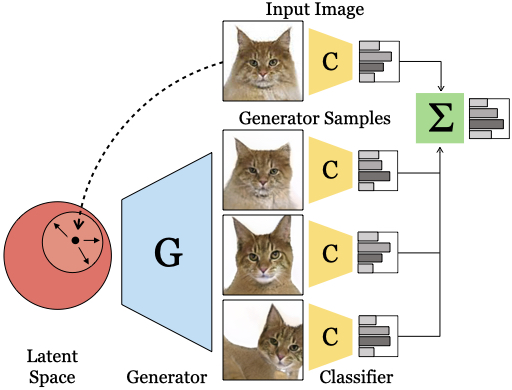

# GAN Ensembling
[Project Page](https://chail.github.io/gan-ensembling/) | [Paper](./)  | [Bibtex](https://chail.github.io/gan-ensembling/bibtex.txt)

 

Ensembling with Deep Generative Views. \
[Lucy Chai](http://people.csail.mit.edu/lrchai/), [Jun-Yan Zhu](https://www.cs.cmu.edu/~junyanz/), [Eli Shechtman](https://research.adobe.com/person/eli-shechtman/), [Phillip Isola](http://web.mit.edu/phillipi/), [Richard Zhang](https://richzhang.github.io/) \
*CVPR 2021* 

## Prerequisites
- Linux
- Python 3
- NVIDIA GPU + CUDA CuDNN

**Table of Contents:**<br>
1. [Colab](#colab) - run a limited demo version without local installation
2. [Setup](#setup) - download required resources<br>
3. [Quickstart](#quickstart) - short demonstration code snippet<br>
4. [Notebooks](#notebooks) - jupyter notebooks for visualization<br>
5. [Pipeline](#pipeline) - details on full pipeline<br>

<a name="colab"/>

[Colab Notebook](https://colab.research.google.com/drive/1-qZBjn07KlWv27kKQGaKOXMBgP-Fb0Ws?usp=sharing) demonstrates the basic latent code perturbation and classification procedure on the aligned cat dataset. 

## Setup

<a name="setup"/>

## Setup

- Clone this repo:
```bash
git clone https://github.com/chail/gan-ensembling.git
cd gan-ensembling
```

- Install dependencies:
	- we provide a Conda `environment.yml` file listing the dependencies. You can create the Conda environment using: 
	```bash
	conda env create -f environment.yml
	```


- Download resources:
	- We provide a script for downloading associated resources. 
	- It will download precomputed latents (cat: 291M, car: 121M, celebahq: 1.8G, cifar10: 883M), a subset of trained models (592M), precomputed results (1.3G), and associated libraries. 
	- Fetch the resources by running 

	```bash
	bash resources/download_resources.sh
	```

	-  *Note, Optional*: to run the StyleGAN ID-invert models, the models need to be downloaded separately. Follow the directions [here](https://github.com/genforce/idinvert_pytorch) to obtain `styleganinv_ffhq256_encoder.pth` and `styleganinv_ffhq256_encoder.pth`, and place them in `models/pretrain`
	-  *Note, Optional*: the download script downloads a subset of the pretrained models for the demo notebook. For further experiments, the additional pretrained models (total 7.0G) can be downloaded [here](http://latent-composition.csail.mit.edu/other_projects/gan_ensembling/zips/pretrained_classifiers.zip); it includes 40 binary face attribute classifiers, and classifiers trained on the different perturbation methods for the remaining datasets.


- Download external datasets:
	- CelebA-HQ: Follow the instructions [here](https://github.com/tkarras/progressive_growing_of_gans) to create the CelebA-HQ dataset and place CelebA-HQ images in directory `dataset/celebahq/images/images`.
	- Cars: This dataset is a subset of [Cars196](https://ai.stanford.edu/~jkrause/cars/car_dataset.html). Download the images from [here](http://imagenet.stanford.edu/internal/car196/cars_train.tgz) and the devkit from [here](https://ai.stanford.edu/~jkrause/cars/car_devkit.tgz). (We are subsetting their training images into train/test/val partitions). Place the images in directory `dataset/cars/images/images` and the devkit in `dataset/cars/devkit`.
	- The processed and aligned cat images are downloaded with the above resources, and cifar10 dataset downloaded via the PyTorch wrapper.

An example of the directory organization is below:
```bash
dataset/celebahq/
	images/images/
		000004.png
		000009.png
		000014.png
		...
	latents/
	latents_idinvert/
dataset/cars/
	devkit/
		cars_meta.mat
		cars_test_annos.mat 
		cars_train_annos.mat 
		...
	images/images/
		00001.jpg
		00002.jpg
		00003.jpg
		...
	latents/
dataset/catface/
	images/
	latents/
dataset/cifar10/
	cifar-10-batches-py/
	latents/
```

<a name="quickstart"/>

## Quickstart

Once the datasets and precomputed resources are downloaded, the following code snippet demonstrates how to perturb GAN images. Additional examples are contained in `notebooks/demo.ipynb`.

```python
import data
from networks import domain_generator

dataset_name = 'celebahq'
generator_name = 'stylegan2'
attribute_name = 'Smiling'
val_transform = data.get_transform(dataset_name, 'imval')
dset = data.get_dataset(dataset_name, 'val', attribute_name, load_w=True, transform=val_transform)
generator = domain_generator.define_generator(generator_name, dataset_name)

index = 100
original_image = dset[index][0][None].cuda()
latent = dset[index][1][None].cuda()
gan_reconstruction = generator.decode(latent)
mix_latent = generator.seed2w(n=4, seed=0)
perturbed_im = generator.perturb_stylemix(latent, 'fine', mix_latent, n=4)
```

<a name="notebooks"/>

## Notebooks
*Important*: First, setup symlinks required for notebooks: `bash notebooks/setup_notebooks.sh`, and add the conda environment to jupyter kernels: `python -m ipykernel install --user --name gan-ensembling`. 

The provided notebooks are:
1. `notebooks/demo.ipynb`: basic usage example
2. `notebooks/evaluate_ensemble.ipynb`: plot classification test accuracy as a function of ensemble weight
3. `notebooks/plot_precomputed_evaluations.ipynb`: notebook to generate figures in paper

<a name="pipeline"/>

## Full Pipeline

The full pipeline contains of three main parts: 
1. optimize latent codes
2. train classifiers
3. evaluate ensemble of GAN-generated images.

Examples for each step of the pipeline are contained in the following scripts:

```bash
bash scripts/optimize_latent/examples.sh
bash scripts/train_classifier/examples.sh
bash scripts/eval_ensemble/examples.sh
```

To add to the pipeline:
- Data: in the `data/` directory, add the dataset in `data/__init__.py`  and create the dataset class and transformation functions. See `data/data_*.py` for examples.
- Generator: modify `networks/domain_generators.py` to add the generator in `domain_generators.define_generator`. The perturbation ranges for each dataset and generator are specified in `networks/perturb_settings.py`.
- Classifier: modify `networks/domain_classifiers.py` to add the classifier in `domain_classifiers.define_classifier`

### Acknowledgements

We thank the authors of these repositories:
- [Gan Seeing](https://github.com/davidbau/ganseeing) for GAN and visualization utilities
- [StyleGAN 2 Pytorch](https://github.com/rosinality/stylegan2-pytorch) for pytorch implementation of StyleGAN 2 and pretrained models
- [Stylegan 2 ADA Pytorch](https://github.com/NVlabs/stylegan2-ada-pytorch) for the class-conditional StyleGAN 2 CIFAR10 generator
- [StyleGAN In-domain inversion](https://github.com/genforce/idinvert_pytorch) for the in-domain stylegan generator and encoder
- [Latent Composition](https://github.com/chail/latent-composition) for some code and remaining encoders
- Cat dataset images are from the [Oxford-IIIT Pet Dataset](https://www.robots.ox.ac.uk/~vgg/data/pets/), aligned using the [Frederic](https://github.com/zylamarek/frederic) landmark detector.

### Citation
If you use this code for your research, please cite our paper:
```
@inproceedings{chai2021ensembling,
  title={Ensembling with Deep Generative Views.},
  author={Chai, Lucy and Zhu, Jun-Yan and Shechtman, Eli and Isola, Phillip and Zhang, Richard},
  booktitle={CVPR},
  year={2021}
 }
```
